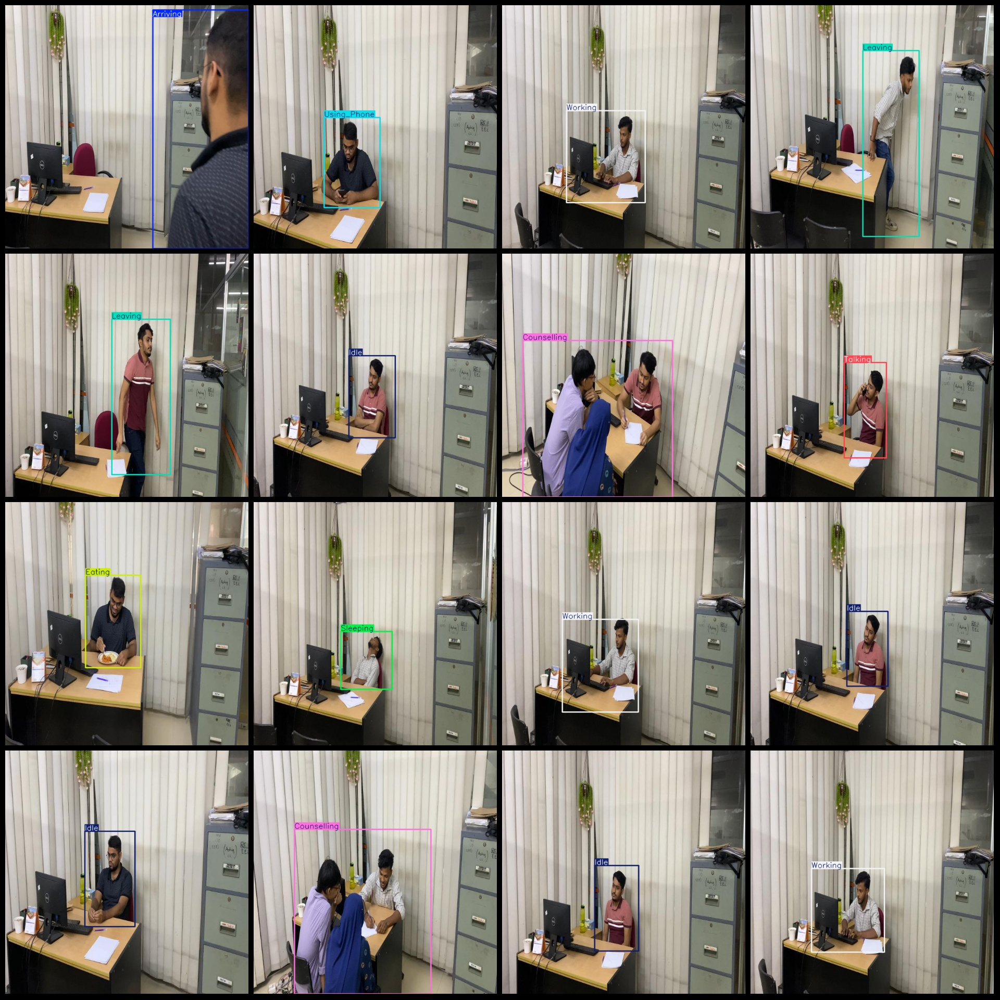
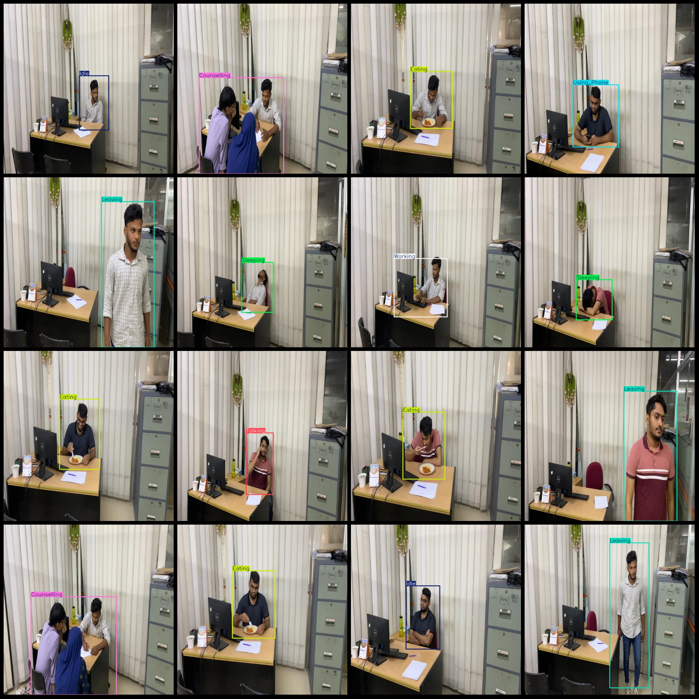

# Workplace Activity Detection Dataset: VOC+YOLO

## Dataset Format
The dataset is in Pascal VOC format combined with YOLO format. The file does not include a split path, but only contains JPG images along with their corresponding VOC format XML files and YOLO format 
txt files.

### Image Count (JPG Files)
- Number of JPG files: 1337

### Annotation Count (XML Files)
- Number of XML files: 1337

### Annotation Count (Txt Files)
- Number of txt files: 1337

### Number of Categories
- Number of categories: 9

### Category Labels
Please note that the order of labels in the YOLO format may differ from this listing, referencing the "labels" folder's "classes.txt" for correct classification.
- ["Arriving", "Counselling", "Eating", "Idle", "Leaving", "Sleeping", "Talking", "Using_Phone", "Working"]

Each category has an associated number of bounding boxes:
- "Arriving" (arrival): 117, occupying 117 images
- "Counselling" (counseling): 181, occupying 181 images
- "Eating" (eating): 159, occupying 159 images
- "Idle" (idle): 130, occupying 130 images
- "Leaving" (leaving): 109, occupying 109 images
- "Sleeping" (sleeping): 172, occupying 172 images
- "Talking" (talking): 137, occupying 137 images
- "Using_Phone" (using_phone): 154, occupying 154 images
- "Working" (working): 178, occupying 178 images

Total bounding box count: 1337

Image resolution: 640x640

Annotation tool used: labelImg

Annotation rules: Draw bounding boxes for each category.

Important Notice: The dataset does not have a division into training, validation, or test sets; please perform your own splitting.

Special Remark: This dataset does not guarantee the accuracy of models trained on this data or weight files.

**Note:** The above image preview is just an example to illustrate how the dataset can be used. You will need to use your own images for actual annotation and testing.

## Images

Here is a pay link on Stripe ( https://buy.stripe.com/3cs8yP7sY87d0vu9AB ). Please contact me lonlonago@foxmail.com after funding $89, and I will send you a complete data files , thank you!

